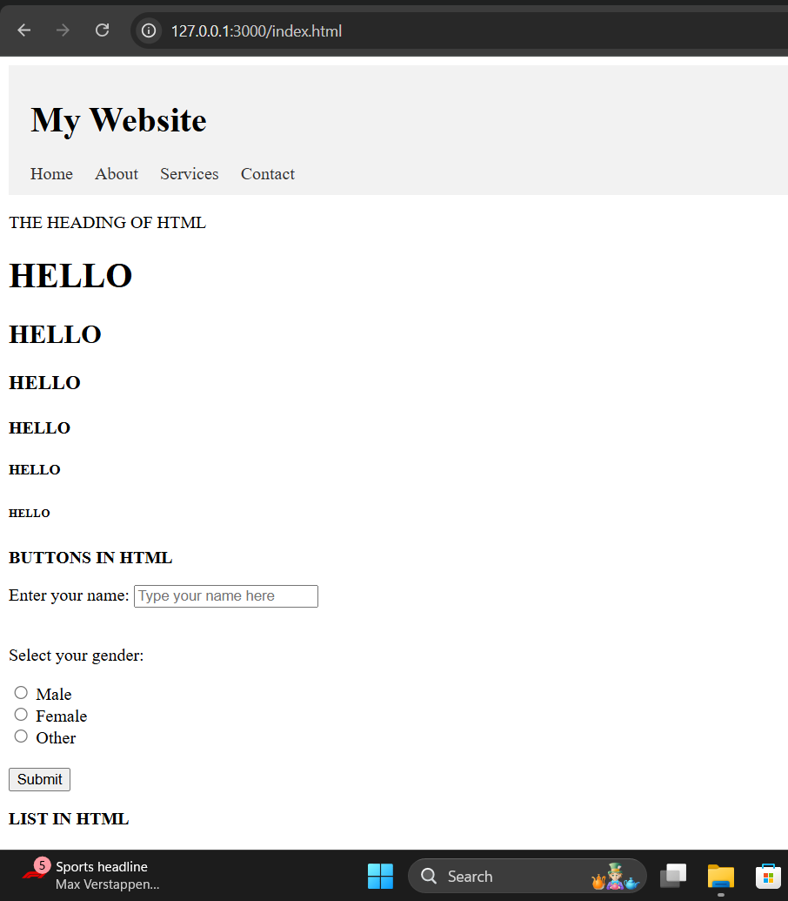
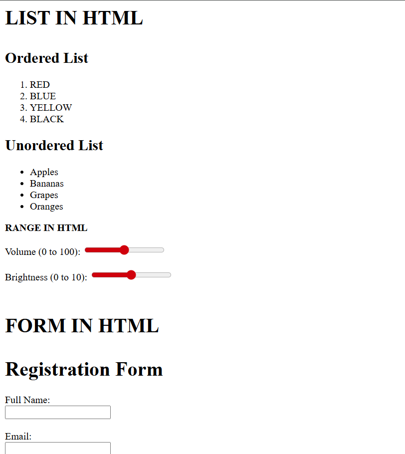
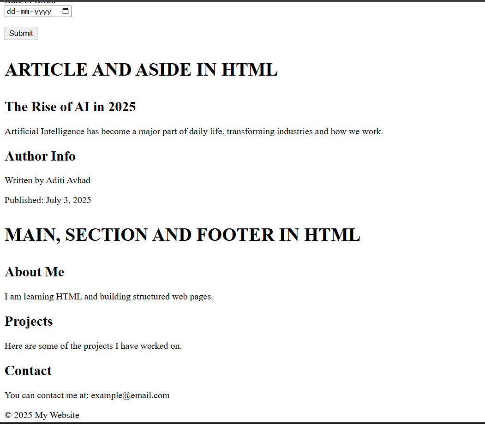
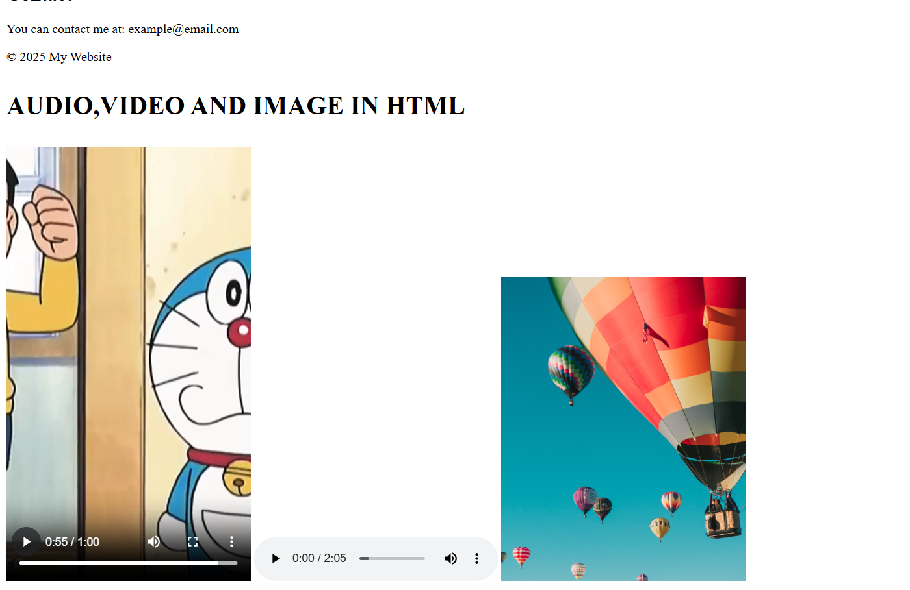

# WebDeveloper
A collection of basic HTML,CSS examples created while learning.

# HTML Basic Project

This is a beginner-level HTML project demonstrating the basic structure of an HTML page. It includes:
- Headings
- Paragraphs
- Semantic Elements
- Images
- Audio elements

## Output Screenshot

