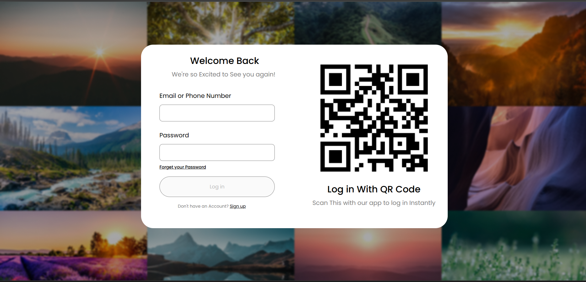

# WebDeveloper
A collection of basic HTML,CSS examples created while learning.

# 🔐 Login Page – HTML & CSS

A simple login page designed using HTML and CSS.  
This project includes custom styling, form validation layout, and a clean user interface.

## 📸 Screenshot

## 📁 Files Included
- `index.html` – Structure of the login form
- `style.css` – Styling for layout, inputs, and buttons
- `ss.png` – Screenshot of the final design

## 🛠️ Tools Used
- Visual Studio Code (VS Code)
- HTML5
- CSS3
- Git & GitHub

