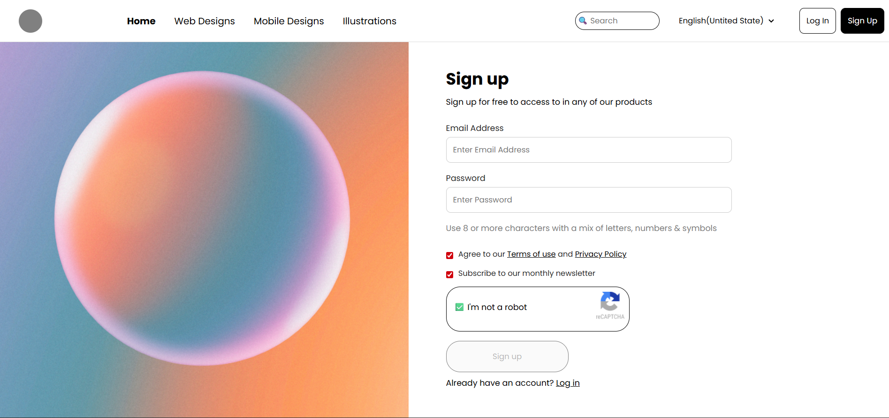

# WebDeveloper
A collection of basic HTML,CSS examples created while learning.\

# Sign Up Page

This project is a simple sign-up form designed using HTML and CSS. It includes:
- Form fields: Name, Email, Password, etc.
- Submit button
- Background image and audio welcome message

## Output Screenshot

